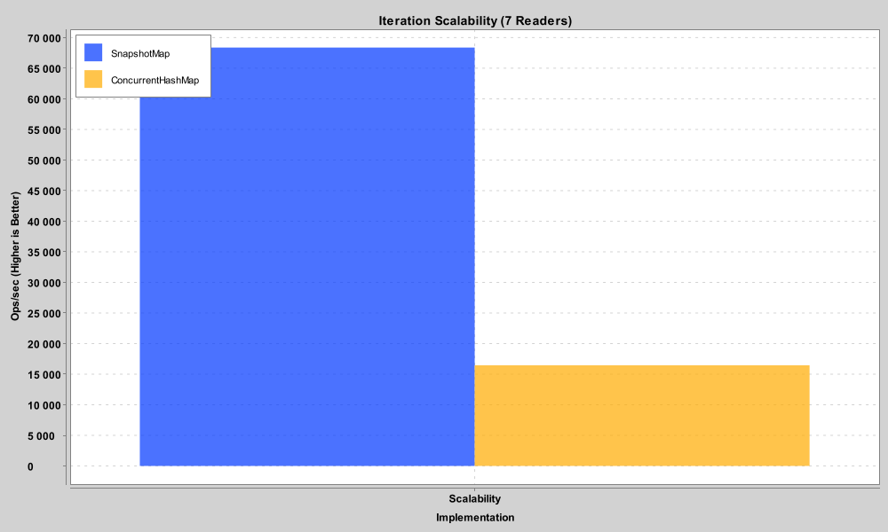
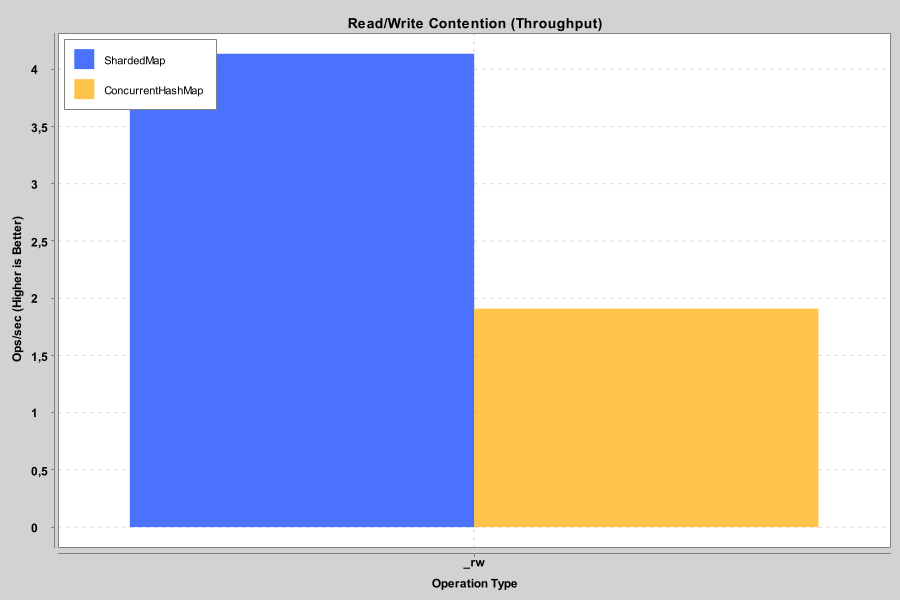

# SnapshotMap

[](https://www.codefactor.io/repository/github/mrlarkyy/snapshotmap)
[](https://repo.nekroplex.com/#/releases/gg/aquatic/snapshotmap)

[](https://discord.com/invite/ffKAAQwNdC)

A high-performance, read-optimized `MutableMap` wrapper for Kotlin/JVM. 

`SnapshotMap` is designed for scenarios where map iterations (`forEach`) are frequent but modifications are occasional. It uses an internal **Array-Snapshot** strategy to provide ultra-fast, lock-free iteration that significantly outperforms standard `ConcurrentHashMap`.

## Features

- **Zero-Allocation Iteration:** Once the snapshot is cached, `forEach` performs no allocations and avoids `Map.Entry` overhead.
- **CPU Cache Friendly:** Data is stored in contiguous arrays, maximizing L3 cache hits during full-map scans.
- **Lock-Free Reads:** Standard point-lookups (`get`) delegate directly to the underlying map with zero-cost abstraction.
- **Smart Invalidation:** Snapshots are lazily rebuilt only when data actually changes, preventing redundant work during frequent "no-op" writes.

## Performance Benchmarks

In our JMH tests with 100,000 items, `SnapshotMap` demonstrates superior scalability in read-heavy environments.

### 1. Iteration Scalability
*Measured with 7 threads iterating and 1 thread performing occasional writes (100ms interval).*
**SnapshotMap is ~2.5x faster** than `ConcurrentHashMap` due to its flat-array memory layout.



### 2. Point R/W Contention
*Standard point-lookups remain competitive with native `ConcurrentHashMap` performance.*



## Usage

### Installation
Add the library to your project:

````kotlin
repositories {
maven("https://repo.nekroplex.com/releases")
}

dependencies {
implementation("gg.aquatic:snapshotmap:26.0.1")
}
````

### Basic Example

```kotlin
// Wraps any ConcurrentHashMap (defaults to a new one)
val map = SnapshotMap<String, Int>()

// Set and Get (Standard ConcurrentHashMap performance)
map["Apple"] = 10
val count = map["Apple"]

// High-Performance Iteration (Snapshot optimized)
map.forEach { key, value ->
// This uses a cached Array<Any?> internally
println("$key -> $value")
}

// Batch updates (Optimized to only invalidate snapshot once)
map.putAll(mapOf("Banana" to 5, "Orange" to 8))
```

---

## 💬 Community & Support

Join our community for support or to discuss performance optimizations!

[](https://discord.com/invite/ffKAAQwNdC)
